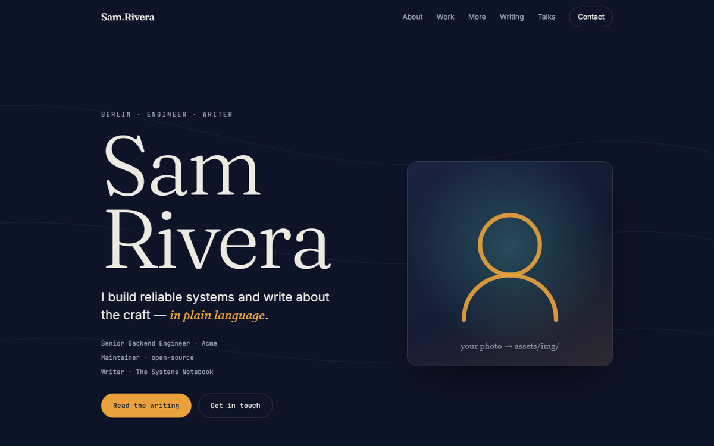

# launchfolio

**A clone-and-replace static portfolio for developers, writers and researchers.**
Edit one config file, connect your content sources, and publish — to GitHub Pages, Azure
or AWS — in minutes. No build step, no framework, no runtime dependencies.



> Built by [Indraneel Pole](https://github.com/poleindraneel). A real-world site running on
> launchfolio: **[indraneelpole.name](https://indraneelpole.name)**.

---

## Why

Most portfolio templates make you fight a framework and a build pipeline to change your
name. launchfolio is the opposite: **all of your content lives in one file**
(`config/site.config.js`). Everything else — theme, SEO tags, nav, sections — is rendered
from it by ~500 lines of dependency-free vanilla JS.

## Features
- **One file to edit.** Identity, sections, theme and links all come from `config/site.config.js`.
- **Modular sections.** Turn any section off with `enabled: false` — it disappears, nav link and all.
- **Connect your writing.** Auto-pull posts from **Medium, Substack, dev.to or any RSS** feed;
  add LinkedIn/manual posts by hand. One command, or a weekly GitHub Action.
- **Live project roadmap.** Point a featured project at a **public GitHub repo** and its
  roadmap syncs from the repo's Milestones (with a static fallback).
- **Themable in seconds.** Colours + Google Fonts are config values.
- **One-command deploys.** GitHub Pages (free), Azure App Service, AWS S3 + CloudFront.
- **Fast & accessible.** Static files, keyboard-navigable, `prefers-reduced-motion`, mobile-first,
  Open Graph + JSON-LD baked in.

## Quickstart
```bash
# 1. Use this template (green button on GitHub) or clone it
git clone https://github.com/poleindraneel/launchfolio my-site
cd my-site

# 2. Make it yours
#    - edit config/site.config.js  (name, sections, theme, links)
#    - drop your photo in assets/img/ and point identity.avatar at it

# 3. Preview
npm run dev            # http://localhost:8080  (needs python or npx)

# 4. (optional) pull your latest posts
npm run fetch

# 5. Publish — pick one
#    GitHub Pages: Settings → Pages → Source: GitHub Actions (workflow included)
npm run deploy:azure   # or
npm run deploy:aws
```

## Customise
| I want to… | Do this |
|------------|---------|
| Change any text, links, colours, fonts | Edit `config/site.config.js` |
| Remove a section | Set its `enabled: false` |
| Reorder sections | Reorder the `<section>` blocks in `index.html` |
| Pull posts from Medium/Substack/dev.to/RSS | Add `sources` to a writing track, run `npm run fetch` — see [docs/SOURCES.md](docs/SOURCES.md) |
| Add a LinkedIn/manual post | Add to a track's `posts` with `manual: true` |
| Sync a project roadmap from GitHub | Set `project.owner` + `project.repoName` |
| Deploy | See [docs/DEPLOY.md](docs/DEPLOY.md) |

Full field reference: **[docs/CONFIGURATION.md](docs/CONFIGURATION.md)**.

## Project structure
```
config/site.config.js   ← the only file you must edit
content/writing.js      ← generated by `npm run fetch` (or hand-edited)
index.html              section skeleton (reorder sections here)
css/styles.css          design system (themed via CSS variables)
js/render.js            renders config → page (you shouldn't need to touch this)
tools/fetch-feeds.mjs   multi-source RSS fetcher (zero deps, Node 18+)
scripts/                serve + deploy scripts
.github/workflows/      Pages deploy + weekly feed refresh
docs/                   configuration, sources, deploy guides
```

## Requirements
- To **view/deploy**: nothing but a static host. (Fonts load from Google Fonts.)
- To **run the fetcher / dev server**: Node 18+ and/or Python 3.

## License
[MIT](LICENSE) © Indraneel Pole. Use it, fork it, ship your site. A ⭐ or a link back is
always appreciated.

## Roadmap / ideas
- More source adapters (Hashnode, Ghost, Bluesky, Mastodon)
- A `npx create-launchfolio` scaffolder
- Section reordering from config
- Additional themes

Contributions welcome — see [CONTRIBUTING.md](CONTRIBUTING.md).
