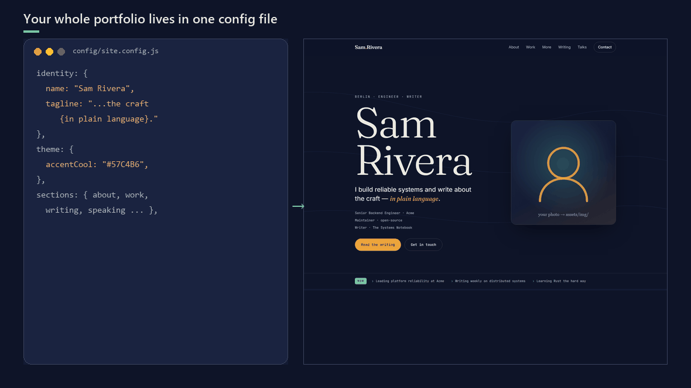

# launchfolio

**The portfolio your AI agent builds for you.** Clone it, point your coding agent
(Claude Code, Cursor, Codex, Copilot…) at it, and get a populated, validated, deployed
portfolio in one prompt. Everything lives in one config file, so it's just as pleasant to
edit by hand. No framework, no build step, no dependencies.

**[▶ Live demo](https://poleindraneel.github.io/launchfolio/)** &nbsp;·&nbsp;
**[Use this template](https://github.com/poleindraneel/launchfolio/generate)** &nbsp;·&nbsp;
MIT licensed &nbsp;·&nbsp; ⭐ **Star it if it saves you an afternoon**



> Built by [Indraneel Pole](https://github.com/poleindraneel). A real-world site running on
> launchfolio: **[indraneelpole.name](https://indraneelpole.name)**.

---

## 🤖 Set up with your AI agent (recommended)

launchfolio is **agent-native**. Clone it (or "Use this template"), open it in your agent, and paste:

> **"Read AGENTS.md, then set up this portfolio for me from the attached résumé / my LinkedIn
> export. Fill `config/site.config.js`, disable sections I have no content for, run
> `npm run check` until it's clean, and show me a preview."**

Why it's fast and cheap for an agent (not just a nicer README):
- **One file to touch.** [`AGENTS.md`](AGENTS.md) tells the agent to edit only
  `config/site.config.js` and to *never* wade through the renderer or CSS.
- **A machine-readable contract.** [`config/site.schema.json`](config/site.schema.json) +
  inline enums mean the agent doesn't grep the code to learn valid values.
- **A deterministic feedback loop.** `npm run check` validates the config and prints precise
  errors **plus a to-do list of leftover placeholders** — so the agent fixes things without
  opening a browser.

Works with any tool that reads **AGENTS.md** (Claude Code, Cursor, Codex, Copilot, Aider,
Gemini CLI, Windsurf…); `CLAUDE.md`, `.cursor/rules`, and Copilot instructions are included as
thin wrappers.

## Why

Most portfolio templates make you fight a framework and a build pipeline to change your
name. launchfolio is the opposite: **all of your content lives in one file**
(`config/site.config.js`). Everything else — theme, SEO tags, nav, sections — is rendered
from it by ~500 lines of dependency-free vanilla JS. That same design is what lets an agent
drive it in one shot.

## Features
- **Agent-ready.** `AGENTS.md` + a config schema + a `npm run check` validator let a coding
  agent build, validate and deploy your site in one prompt (see above).
- **One file to edit.** Identity, sections, theme and links all come from `config/site.config.js`.
- **Modular sections.** Turn any section off with `enabled: false` — it disappears, nav link and all.
- **Connect your writing.** Auto-pull posts from **Medium, Substack, dev.to or any RSS** feed;
  add LinkedIn/manual posts by hand. One command, or a weekly GitHub Action.
- **Live project roadmap.** Point a featured project at a **public GitHub repo** and its
  roadmap syncs from the repo's Milestones (with a static fallback).
- **Themable in seconds.** Colours + Google Fonts are config values.
- **One-command deploys.** GitHub Pages (free), Azure App Service, AWS S3 + CloudFront.
- **Fast & accessible.** Static files, keyboard-navigable, `prefers-reduced-motion`, mobile-first,
  Open Graph + JSON-LD baked in.

## Quickstart
```bash
# 1. Use this template (green button on GitHub) or clone it
git clone https://github.com/poleindraneel/launchfolio my-site
cd my-site

# 2. Make it yours
#    - edit config/site.config.js  (name, sections, theme, links)
#    - drop your photo in assets/img/ and point identity.avatar at it

# 3. Validate your edits (lists errors + any leftover placeholders)
npm run check

# 4. Preview
npm run dev            # http://localhost:8080  (needs python or npx)

# 5. (optional) pull your latest posts
npm run fetch

# 6. Publish — pick one
#    GitHub Pages: Settings → Pages → Source: GitHub Actions (workflow included)
npm run deploy:azure   # or
npm run deploy:aws
```

## Customise
| I want to… | Do this |
|------------|---------|
| Change any text, links, colours, fonts | Edit `config/site.config.js` |
| Remove a section | Set its `enabled: false` |
| Reorder sections | Reorder the `<section>` blocks in `index.html` |
| Pull posts from Medium/Substack/dev.to/RSS | Add `sources` to a writing track, run `npm run fetch` — see [docs/SOURCES.md](docs/SOURCES.md) |
| Add a LinkedIn/manual post | Add to a track's `posts` with `manual: true` |
| Sync a project roadmap from GitHub | Set `project.owner` + `project.repoName` |
| Deploy | See [docs/DEPLOY.md](docs/DEPLOY.md) |

Full field reference: **[docs/CONFIGURATION.md](docs/CONFIGURATION.md)**.

## Project structure
```
AGENTS.md               ← how an AI agent should work on this repo (CLAUDE.md/Cursor import it)
config/site.config.js   ← the only file you must edit
config/site.schema.json the config contract (validation + IDE autocomplete)
tools/validate-config.mjs  `npm run check` — validates the config, lists to-dos
content/writing.js      ← generated by `npm run fetch` (or hand-edited)
index.html              section skeleton (reorder sections here)
css/styles.css          design system (themed via CSS variables)
js/render.js            renders config → page (you shouldn't need to touch this)
tools/fetch-feeds.mjs   multi-source RSS fetcher (zero deps, Node 18+)
scripts/                serve + deploy scripts
.github/workflows/      Pages deploy + weekly feed refresh
docs/                   configuration, sources, deploy guides
```

## Requirements
- To **view/deploy**: nothing but a static host. (Fonts load from Google Fonts.)
- To **run the fetcher / dev server**: Node 18+ and/or Python 3.

## Showcase — sites built with launchfolio
- [indraneelpole.name](https://indraneelpole.name) — Indraneel Pole (the original)

Built your site with launchfolio? Open a PR adding it here — I'd love to see it.

## License
[MIT](LICENSE) © Indraneel Pole. Use it, fork it, ship your site. A ⭐ or a link back is
always appreciated.

## Roadmap / ideas
- More source adapters (Hashnode, Ghost, Bluesky, Mastodon)
- A `npx create-launchfolio` scaffolder
- Section reordering from config
- Additional themes

Contributions welcome — see [CONTRIBUTING.md](CONTRIBUTING.md).
